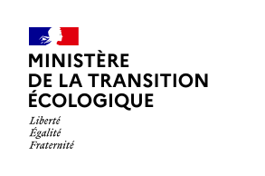

# Site web Trackdéchets

**CMS pour le site web Trackdéchets**

</img>
</img>

# Introduction

Micro-cms pour administrer:
- le contenu de l'assistance questions-réponses guidées de Trackdéchets
- le site web Trackdéchets etle calendrier des formations

# Pré-requis

- Python >= 3.12
- pipenv

# Installation

Initialisation et activation d'un environnement

```
$ pipenv shell
```

Installation des dépendances

```
$ pipenv install -d
```

# Environnement

Se référer au fichier src/core/settings/env.dist

# Linting

Utiliser : 

```
    $ ./lint.sh
```


## Licence

Le code source du logiciel est publié sous licence [MIT](https://fr.wikipedia.org/wiki/Licence_MIT).
