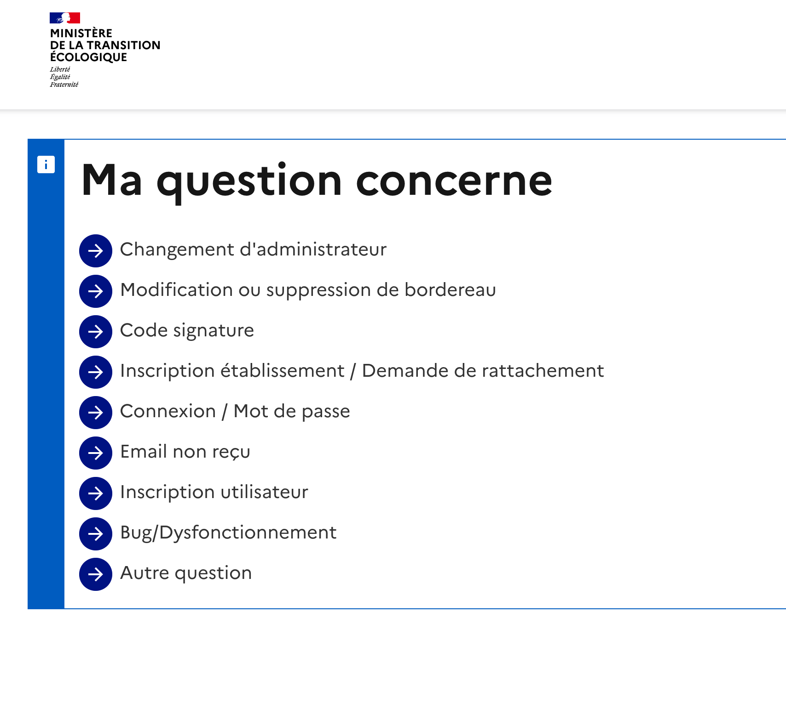
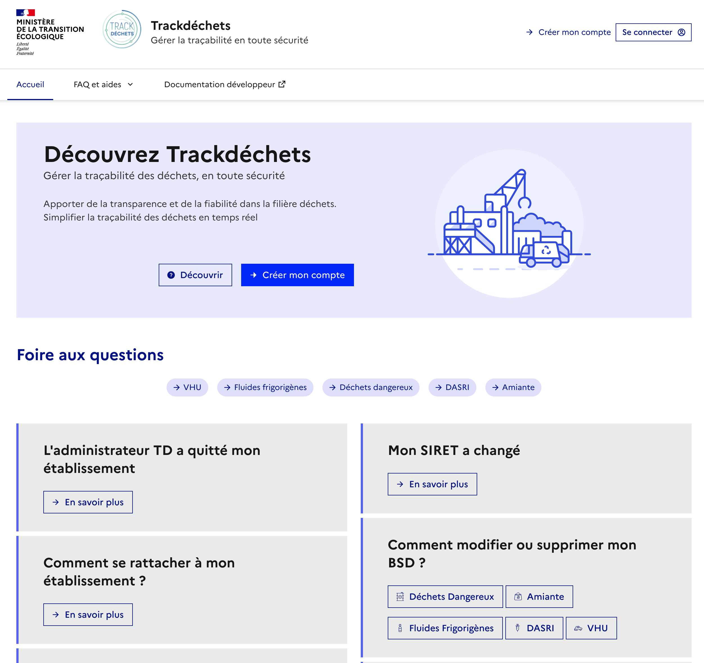

# Site web Trackdéchets & application d'assistance

**CMS pour le site web Trackdéchet et le funnel d'assistance**

</img>
</img>

# Introduction

Micro-cms pour administrer:

- le contenu de l'assistance questions-réponses guidées de Trackdéchets
- le site web Trackdéchets et le calendrier des formations


</img>

</img>

# Pré-requis

- Python >= 3.13
- [uv](https://docs.astral.sh/uv/)

# Installation

Installation des dépendances

```
$ uv sync --frozen
```

Pour les dépendances de test et de développement.

```
$ uv sync --frozen --group test --group dev
```

# Environnement

Se référer au fichier src/core/settings/env.dist

# Linting

Utiliser :

```
    $ ./lint.sh
```

## Licence

Le code source du logiciel est publié sous licence [MIT](https://fr.wikipedia.org/wiki/Licence_MIT).
